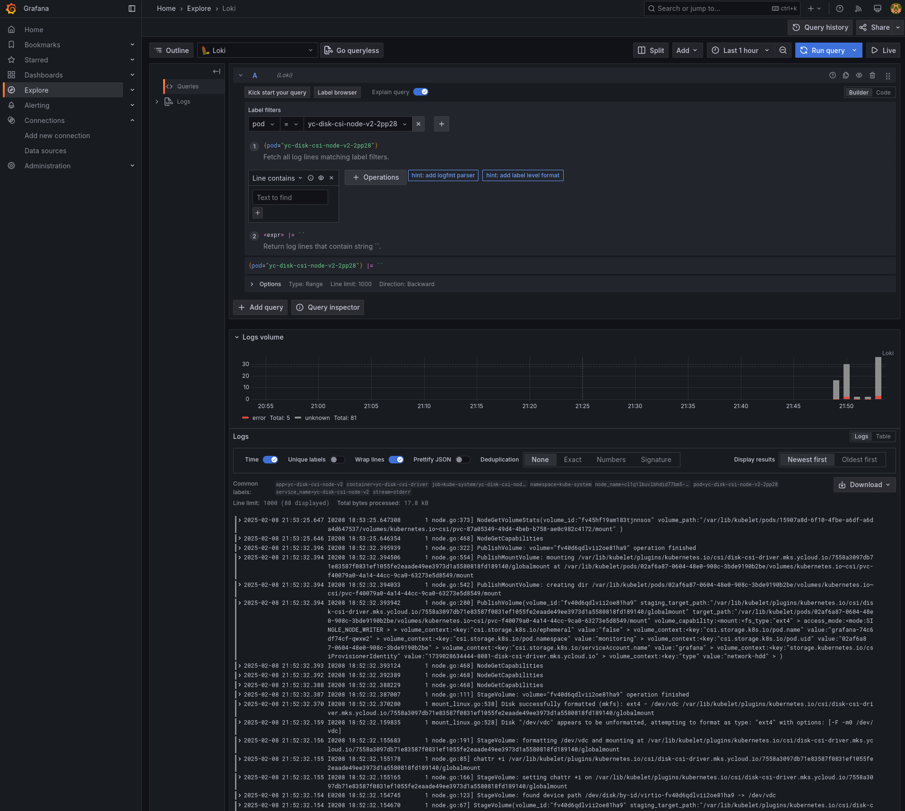

# Репозиторий для выполнения домашних заданий курса "Инфраструктурная платформа на основе Kubernetes-2024-10" 

## Домашнее задание №9. Сервисы централизованного логирования для Kubernetes

Домашнее задание выполнено в `Managed Service for Kubernetes` в `Yandex Cloud`

```
kubectl get nodes

NAME                        STATUS   ROLES    AGE   VERSION
cl1q1lbuvlbhdid77bm5-evev   Ready    <none>   56s   v1.29.1
cl1q1lbuvlbhdid77bm5-yxoj   Ready    <none>   43s   v1.29.1
```

1. Создано 2 пула по 1 ноде:

 - для рабочей нагрузки
 - для инфраструктурных сервисов с `taint` `node-role=infra:NoSchedule`

```bash
kubectl label nodes cl1q1lbuvlbhdid77bm5-evev node-role=infra
```
```bash
kubectl taint nodes cl1q1lbuvlbhdid77bm5-evev node-role=infra:NoSchedule
```
```bash
kubectl get node -o wide --show-labels
```
```
NAME                        STATUS   ROLES    AGE    VERSION   INTERNAL-IP   EXTERNAL-IP       OS-IMAGE             KERNEL-VERSION      CONTAINER-RUNTIME     LABELS
cl1q1lbuvlbhdid77bm5-evev   Ready    <none>   116s   v1.29.1   10.131.0.9    158.160.144.252   Ubuntu 20.04.6 LTS   5.4.0-196-generic   containerd://1.6.28   beta.kubernetes.io/arch=amd64,beta.kubernetes.io/instance-type=standard-v3,beta.kubernetes.io/os=linux,failure-domain.beta.kubernetes.io/zone=ru-central1-d,kubernetes.io/arch=amd64,kubernetes.io/hostname=cl1q1lbuvlbhdid77bm5-evev,kubernetes.io/os=linux,node-role=infra,node.kubernetes.io/instance-type=standard-v3,node.kubernetes.io/kube-proxy-ds-ready=true,node.kubernetes.io/masq-agent-ds-ready=true,node.kubernetes.io/node-problem-detector-ds-ready=true,topology.kubernetes.io/zone=ru-central1-d,yandex.cloud/node-group-id=cat16lm92niktjkjr9bj,yandex.cloud/pci-topology=k8s,yandex.cloud/preemptible=true
cl1q1lbuvlbhdid77bm5-yxoj   Ready    <none>   103s   v1.29.1   10.131.0.24   158.160.135.246   Ubuntu 20.04.6 LTS   5.4.0-196-generic   containerd://1.6.28   beta.kubernetes.io/arch=amd64,beta.kubernetes.io/instance-type=standard-v3,beta.kubernetes.io/os=linux,failure-domain.beta.kubernetes.io/zone=ru-central1-d,kubernetes.io/arch=amd64,kubernetes.io/hostname=cl1q1lbuvlbhdid77bm5-yxoj,kubernetes.io/os=linux,node.kubernetes.io/instance-type=standard-v3,node.kubernetes.io/kube-proxy-ds-ready=true,node.kubernetes.io/masq-agent-ds-ready=true,node.kubernetes.io/node-problem-detector-ds-ready=true,topology.kubernetes.io/zone=ru-central1-d,yandex.cloud/node-group-id=cat16lm92niktjkjr9bj,yandex.cloud/pci-topology=k8s,yandex.cloud/preemptible=true

```
```bash
kubectl get nodes -o custom-columns=NAME:.metadata.name,TAINTS:.spec.taints
```
```
NAME                        TAINTS
NAME                        TAINTS
cl1q1lbuvlbhdid77bm5-evev   [map[effect:NoSchedule key:node-role value:infra]]
cl1q1lbuvlbhdid77bm5-yxoj   <none>
```
2. Созданы бакеты в S3 object storage Yandex cloud, сервис аккаунт с правами `storage.uploader` и `storage.viewer` и статический ключ для него.

```bash
yc storage bucket list
```
```
+------------------------+----------------------+-------------+-----------------------+---------------------+
|          NAME          |      FOLDER ID       |  MAX SIZE   | DEFAULT STORAGE CLASS |     CREATED AT      |
+------------------------+----------------------+-------------+-----------------------+---------------------+
| homework9-bucket-ruler | -------------------- |  1073741824 | STANDARD              | 2025-02-08 18:43:06 |
| homework9-bucket-admin | -------------------- |  1073741824 | STANDARD              | 2025-02-08 18:43:13 |
| homework9-bucket       | -------------------- | 53687091200 | STANDARD              | 2025-02-08 17:08:48 |
+------------------------+----------------------+-------------+-----------------------+---------------------+
```
```bash
yc iam access-key create \
    --service-account-name=loki \
    --format=json > sa-key.json
```

3. В кластер установлен `loki`:
```bash
helm repo add grafana https://grafana.github.io/helm-charts
```
```bash
helm repo update
```
```bash
helm upgrade loki --install --namespace logging --create-namespace grafana/loki \
    --values values-loki.yaml \
    --set loki.storage.s3.accessKeyId=$(cat sa-key.json | jq -r .access_key.key_id) \
    --set loki.storage.s3.secretAccessKey=$(cat sa-key.json | jq -r .secret)
```
[values-loki.yaml](./values-loki.yaml)

4. В кластер установлен `promtail`:
```bash
helm upgrade promtail --install --namespace logging --create-namespace --values values-promtail.yaml grafana/promtail
```
[values-promtail.yaml](./values-promtail.yaml)

5. В кластер установлена `Grafana`:
```bash
helm upgrade grafana --install --namespace monitoring --create-namespace --values values-grafana.yaml grafana/grafana
```
[values-grafana.yaml](./values-grafana.yaml)

6. `http://loki-gateway.logging.svc.cluster.local/` добавлен в качестве `data source` - [Loki](./values-grafana.yaml#L21) в Grafana:


